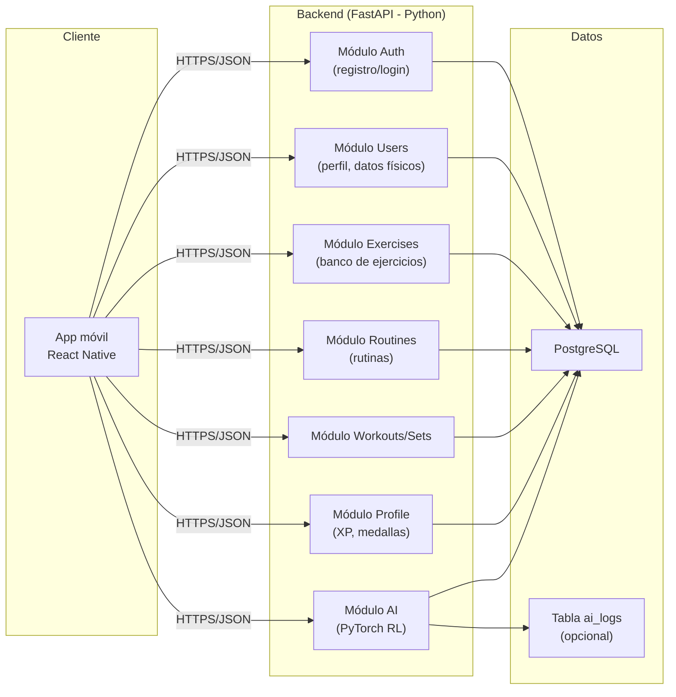
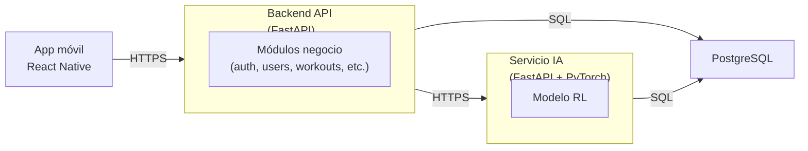

```mermaid
flowchart LR
    subgraph Client["Cliente"]
        RN["App móvil<br/>React Native"]
    end

    subgraph Backend["Backend (FastAPI - Python)"]
        AUTH["Módulo Auth<br/>(registro/login)"]
        USERS["Módulo Users<br/>(perfil, datos físicos)"]
        EXERCISES["Módulo Exercises<br/>(banco de ejercicios)"]
        ROUTINES["Módulo Routines<br/>(rutinas)"]
        WORKOUTS["Módulo Workouts/Sets"]
        PROFILE["Módulo Profile<br/>(XP, medallas)"]
        AI["Módulo AI<br/>(PyTorch RL)"]
    end

    subgraph Data["Datos"]
        DB["PostgreSQL"]
        AI_LOGS["Tabla ai_logs<br/>(opcional)"]
    end

    RN -->|HTTPS/JSON| AUTH
    RN -->|HTTPS/JSON| USERS
    RN -->|HTTPS/JSON| EXERCISES
    RN -->|HTTPS/JSON| ROUTINES
    RN -->|HTTPS/JSON| WORKOUTS
    RN -->|HTTPS/JSON| PROFILE
    RN -->|HTTPS/JSON| AI

    AUTH --> DB
    USERS --> DB
    EXERCISES --> DB
    ROUTINES --> DB
    WORKOUTS --> DB
    PROFILE --> DB

    AI --> DB
    AI --> AI_LOGS
```

```mermaid
flowchart LR
RN["App móvil<br/>React Native"]

    subgraph API["Backend API<br/>(FastAPI)"]
        MODS["Módulos negocio<br/>(auth, users, workouts, etc.)"]
    end

    subgraph ML["Servicio IA<br/>(FastAPI + PyTorch)"]
        MODEL["Modelo RL"]
    end

    DB["PostgreSQL"]

    RN -->|HTTPS| API
    API -->|SQL| DB
    API -->|HTTPS| ML
    ML -->|SQL| DB
```
